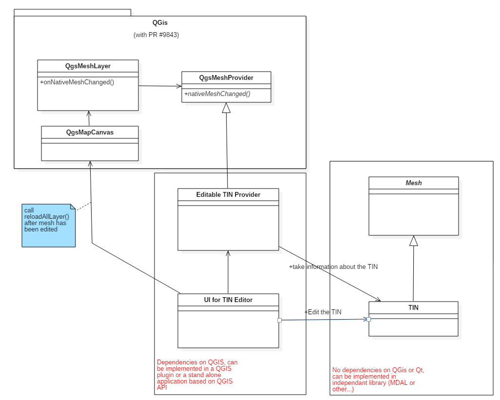

# Mesher

## Presentation
A mesher based on the QGis API

The aim of this project is to provide a Mesher in a GIS environment based on QGIS API.

This mesher will be able to generate TIN DEM and other unstructured grids for hydraulic models.

It will be a part of the Reos project, a free and open sources solution dedicated to hydrology and surface hydraulic (http://www.project.reos.site).

## TODO list
- [X] add flip faces functionality
- [ ] Save/open a TIN : using MDAL for the vertices and faces and another file for the editor data (hardline or other specificities). Using MDAL would permit to open and display the TIN with QGIS.
- [ ] add possibility to modify the Z value of vertices.
- [ ] add tool to set automaticaly the Z value for the vertices.
- [ ] Import point and lines forme vector files or layers.
- [ ] Try to open a QGIS 3D map view and display the TIN when editing it in the 2D map view

## Working principle with QGIS API

